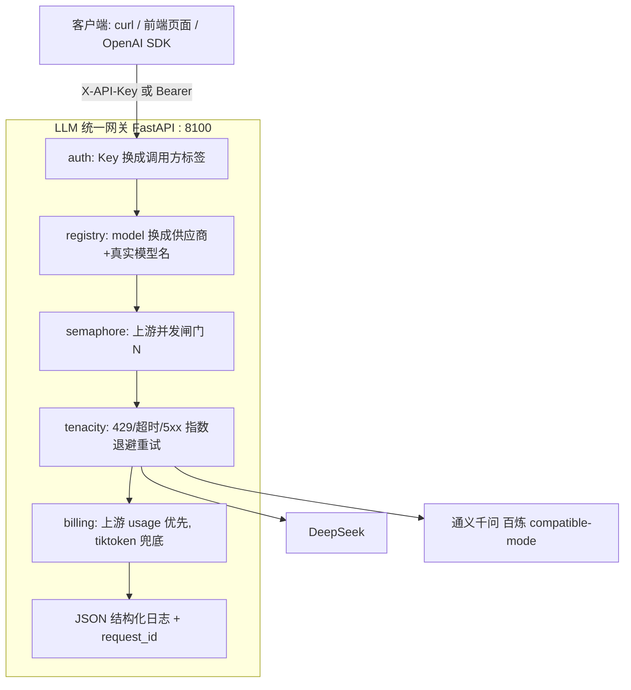

# 架构图

```mermaid
flowchart TD
  C["客户端: curl / 前端页面 / OpenAI SDK"]
  subgraph GW["LLM 统一网关  FastAPI : 8100"]
    A["auth: Key 换成调用方标签"]
    R["registry: model 换成供应商+真实模型名"]
    S["semaphore: 上游并发闸门 N"]
    T["tenacity: 429/超时/5xx 指数退避重试"]
    B["billing: 上游 usage 优先, tiktoken 兜底"]
    L["JSON 结构化日志 + request_id"]
  end
  D["DeepSeek"]
  Q["通义千问 百炼 compatible-mode"]
  C -- "X-API-Key 或 Bearer" --> A
  A --> R --> S --> T
  T --> D
  T --> Q
  T --> B --> L
```